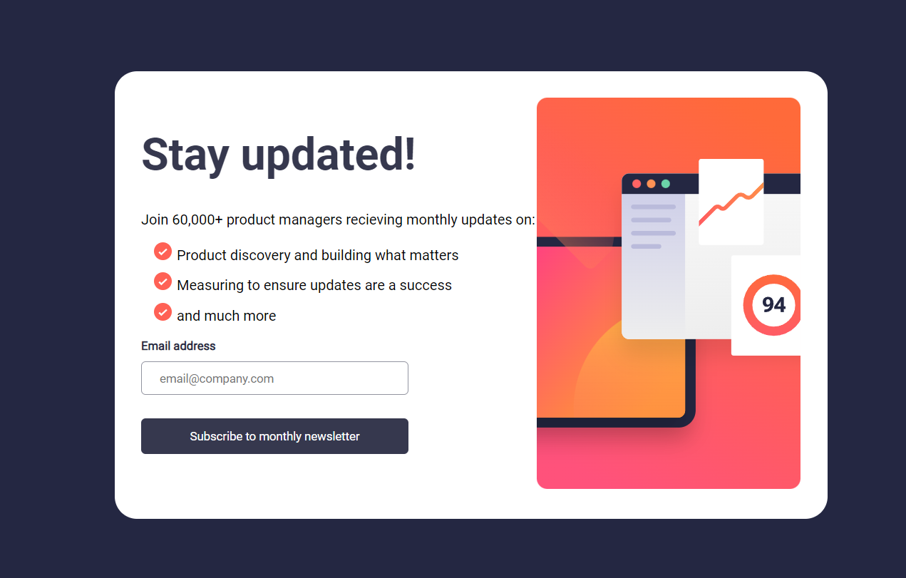
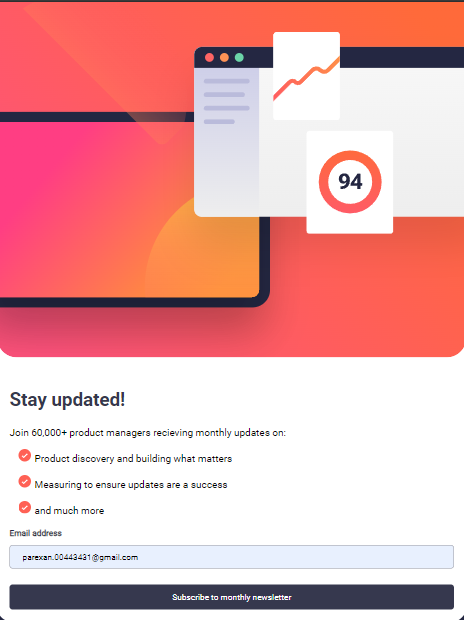
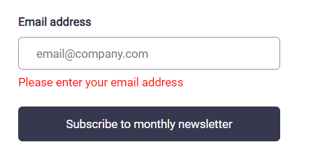
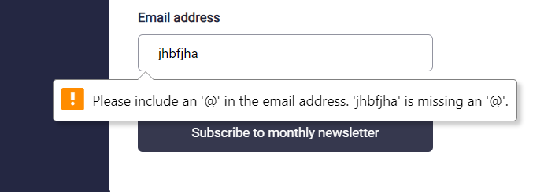
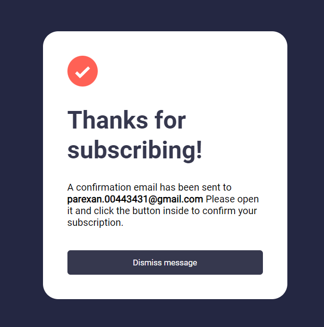

# Frontend Mentor - Newsletter sign-up form with success message solution

This is a solution to the [Newsletter sign-up form with success message challenge on Frontend Mentor](https://www.frontendmentor.io/challenges/newsletter-signup-form-with-success-message-3FC1AZbNrv). Frontend Mentor challenges help you improve your coding skills by building realistic projects. 

## Table of contents

- [Overview](#overview)
  - [The challenge](#the-challenge)
  - [Screenshot](#screenshot)
  - [Links](#links)
- [My process](#my-process)
  - [Built with](#built-with)
  - [What I learned](#what-i-learned)
  - [Continued development](#continued-development)
- [Author](#author)

## Overview

### The challenge

Users should be able to:

- Add their email and submit the form
- See a success message with their email after successfully submitting the form
- See form validation messages if:
  - The field is left empty
  - The email address is not formatted correctly
- View the optimal layout for the interface depending on their device's screen size
- See hover and focus states for all interactive elements on the page

### Screenshot

### Links

- Solution URL: [Add solution URL here](https://your-solution-url.com)
- Live Site URL: [Add live site URL here](https://your-live-site-url.com)

## My process

### Built with

- Semantic HTML5 markup
- Flexbox
- Mobile-first workflow
- Javascript

### What I learned

in this challenge, I learned How to use classList property in javascript, for adding or removing CSS classes to add a better functionality also a better design to my page. 

### Continued development

in my future projects, I would like to continue learning about responsiveness of a wepage, and also I want to solve nex challenge using django and react together, so I can improve both the back and front ends of the website skils that I have.

## Author

- Website - [parykhan jameel](https://parykhanjameel.netlify.app/)
- Frontend Mentor - [@parykhan-jameel](https://www.frontendmentor.io/profile/parykhan-jameel)
- LinkedIn - [parykhan Jameel](https://linkedin.com/in/parykhan-jameel)

